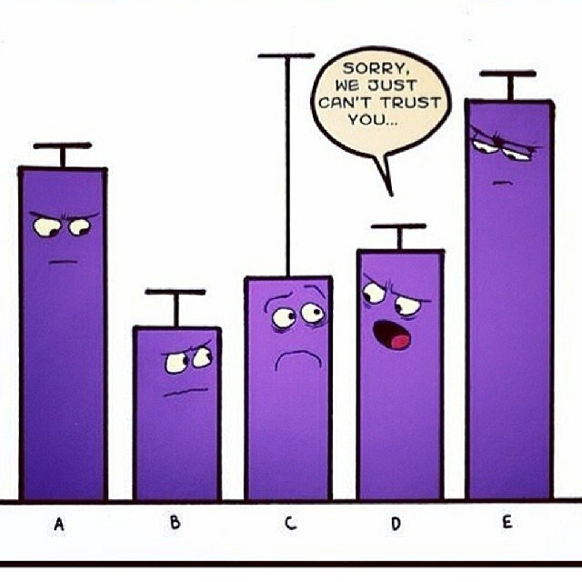
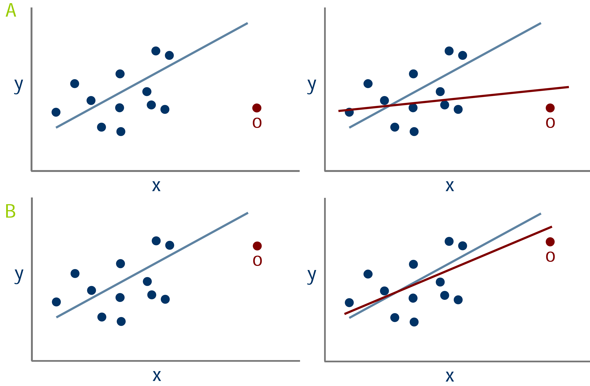
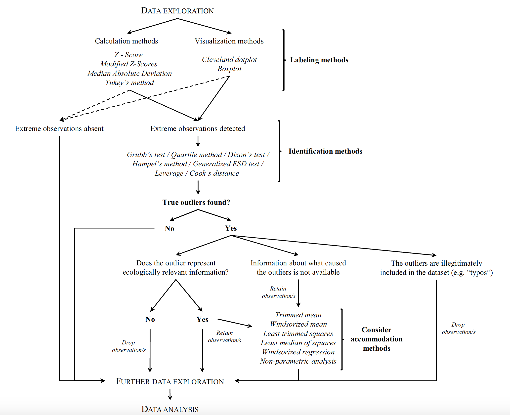
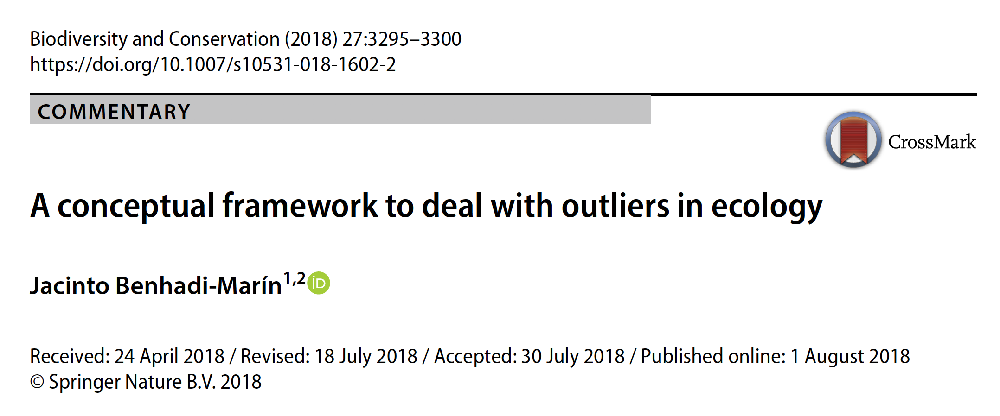
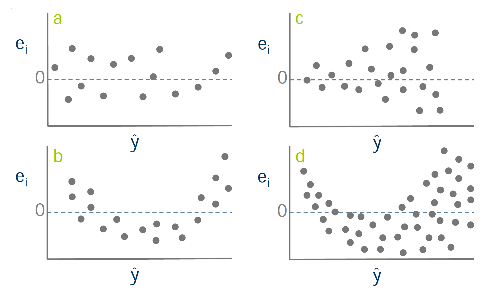

```{r options, include=FALSE, cache=FALSE}
library(rmarkdown)
library(knitr)
library(here)
library(tidyverse)
library(ggrepel)
library(ggplot2)
library(WVPlots)
library(GGally)


## Text results
opts_chunk$set(echo = FALSE, warning = FALSE, message = FALSE)

## Code decoration
opts_chunk$set(tidy = FALSE, comment = NA, highlight = TRUE, size = "footnotesize")

```


## 

```{r qp_table}
qp <- read_csv(here::here("/datos/biomass_pyrenaica.csv"))
kable(head(qp, 8))
```

## 

```{r qp_plot}
qp %>% ggplot(aes(x=d, y=h)) + 
  geom_point(size=5, col="black", fill= "#37474f", alpha=.8, shape=21) + 
  theme_minimal() + xlab('DBH') + ylab('Tree height') +
  theme(axis.title = element_text(size = 16, face = "bold"),
        axis.text = element_text(size=14))
```

## Análisis exploratorio de Datos

- Es una actitud (**iterativa**) hacia los datos, mas que un conjunto de técnicas 

- Detective por un día. No hay una formula mágica

- Encontrar patrones, revelar la estructura, evaluar posibles relaciones... 

- Generar preguntas sobre los datos 

- Buscar respuestas mediante la visualización, tranformación y "modelado" de los datos

## Protocolo para explorar los datos

\begincols
\begincol 

1. Detectar valores anómalos (outliers) 

2. Homogeneidad 

3. Normalidad 

4. Relaciones 

5. Colinearidad 

6. Interacciones

7. Independencia

\endcol
\begincol 

\endcol
\endcols

## Valores extremos (atípicos) - Outliers 

Observaciones extremas, muy alejadas de la mayoría de las observaciones de la varible de interés. 

Los **outliers** pueden influir sustancialmente el análisis estadístico. 



## 
Ojo, los outliers pueden ser el interés de nuestro estudio (epidemiología, eventos extremos)

```{r outlier_prec}
presn <- read_csv(here::here("/datos/cummulated_precSN.csv"))

meandf <- mean(presn$csum_mean)
sddf <- sd(presn$csum_mean)
yeah <- presn %>% filter(csum_mean < (meandf - 1*sddf)) %>% 
  mutate(pos = csum_mean - 50) %>%  as.data.frame()
  
ggplot(presn, aes(x=hyear, y=csum_mean)) + 
  geom_hline(yintercept = meandf) + 
  geom_hline(yintercept = meandf + 2*sddf, color ='blue', linetype = 'dashed') +
  geom_hline(yintercept = meandf - 2*sddf, color ='red', linetype = 'dashed') +
  geom_hline(yintercept = meandf + 1*sddf, color ='blue', linetype = 'dotted') +
  geom_hline(yintercept = meandf  - 1*sddf, color ='red', linetype = 'dotted') +
  geom_errorbar(aes(ymin = csum_mean - csum_se, ymax= csum_mean + csum_se), width=.1, colour='gray') +
  geom_point(size=2) + theme_bw() + 
  geom_line(size=.25, colour = 'black') + 
  scale_x_continuous(breaks=seq(1950,2015, by=5)) +
  scale_y_continuous(breaks=seq(0,1500, by=250)) + 
  geom_text_repel(
    data = yeah,
    aes(label = hyear), 
    size = 2.5, 
    alpha = .5,
    colour = "black",
    segment.size = 0.1, 
    segment.alpha = 0.5,
    point.padding=unit(.7,'lines'),
    nudge_y = -yeah$csum_mean,
    direction = 'x'
    ) +
  theme(panel.grid = element_blank(),
        axis.title = element_text(size = 9),
        axis.text.y = element_text(size = 8)) +
  ylab('Cumulative Precipitation (mm)') + xlab('Year') +
  expand_limits(y=c(0,2000)) 

```

## Outliers. ¿Cómo proceder?



## Outiliers. Identificación visual 


## 
\begincols
\begincol
```{r boxplot1, fig.height=8}
boxplot(iris$Sepal.Width, ylab = "Sepal Width (mm)")
```
\endcol
\begincol
```{r boxplot2, fig.height=8}
boxplot(Sepal.Width~Species, data=iris, ylab = "Sepal Width (mm)")
```
\endcol
\endcols

 
## Cleveland dotplot

Orden de la observación *vs*. Valores observados 

```{r dotchart, fig.height=5}
iph <- read.table(file=here::here("/datos/iz/IrishPh.txt"), header = TRUE, dec = ".")

dotchart(iph$Altitude, pch = 19, pt.cex = .7,
         xlab = "Elevation", 
         ylab = "Order of the data")
```

## Outliers - Test

- Visualización subjetiva
- Aplicación de un test 

  - Z-score $Z_i = \frac{Y_i - \overline{y}}{\hat{\sigma}}$ > 3 
  - Método de Tukey (Boxplot)
  - Test de Grubb. Detecta la presencia de al menos un outlier en el dataset
  
- package [`outlier`](https://cran.r-project.org/web/packages/outliers/index.html)

{height=150px}

## ¿Cómom proceder con los Outliers? 

1. Eliminarlos

2. ¿Representan información ecologicamente relevante? 

3. Construir modelos con/sin outliers

4. Aplicar métodos que acomoden la presencia de outliers: 

  - Análisis no paramétricos
  - Trimmed means (Anovas Robustas) 
  - Aplicar una transformación (cuidado!!)

## Homogeneidad de la varianza (*homocedasticidad*)

- Asume que la dispersión de todos los posibles valores de la población es la misma para cada valor de la covariable
- Cuando no se cumple, se puede producir una estimación de los errores estándar errónea, lo que implica que los intervalos de confianza que se calculan están sesgados (muy estrechos o muy amplios)
- Mas importante que la normalidad (mod. lineales)


{height=200px}

## ¿Cómo detectar la homogeneidad de las varianzas? 
- Boxplot condicionales

```{r boxplot_conditional}

benthos <- read.table(file=here::here("/datos/iz/macro.txt"), header = TRUE)
benthos$fTaxonID <- factor(benthos$TaxonID,
                           levels = c(1, 2, 3, 4, 5),
                           labels = c ("Mol","Cru","Ech","Sip","Pol"))


ggplot(benthos, aes(x=fTaxonID, y=Abundance)) + geom_boxplot() + theme_classic()
```

## 
```{r homo_continua}
fur <- read.table(file=here::here("/datos/iz/fur.txt"), header = TRUE)

fur$Sex2 <- fur$Sex
fur$Sex2[fur$Sex == 1] <- 1
fur$Sex2[fur$Sex == 2] <- 16

fur <- fur %>% mutate(sexF = case_when(
  Sex == 1 ~ "Male", 
  Sex == 2 ~ "Female"
))

ggplot(fur, aes(y=VAR26, x = IS, colour=sexF)) + 
  geom_point(size = 3, aes(shape=sexF)) + theme_classic() + 
  scale_color_manual(values = c("black", "gray")) +
  ylab("Longitudinal length of lower alveoli (Fur Seal") + 
  xlab("Age")
```

## Test para detectar la homogeneidad de las varianzas

- Test de Barlett (`bartlett.test()`)
  - Asume que la varianza de la muestra o de cada grupo es igual
  - Requiere que los datos sean normales
  
```{r, eval=FALSE}
bartlett.test(Abundance ~ fTaxonID, data= benthos)
```
  
- Test de Levene  
  - Asume igualdad de varianza entre las poblaciones. 
  - Menos sensible a la no-normalidad 
  - `levene.test()` paquete `lawstat` 
  
- Boxplot de Residuos del modelo *vs.* Valores ajustados

### ¿Cómo manejar la heterocedasticidad? 
1. Transformar la variable respuesta para estabilizar la varianza

2. Aplicar técnicas que no requieran heterocedasticidad 

## Normalidad 

### Técnicas para detectar normalidad 
- Histogramas simples y condicionales 
- Gráficos de Densidad (*kernels*)

```{r, fig.height=4}
hist(iris$Sepal.Width, prob=TRUE, 
     xlab= "Sepal Width (mm)", main='')# prob=TRUE for probabilities not counts
lines(density(iris$Sepal.Width), col="blue", lwd=2) # add a density estimate with defaults
lines(density(iris$Sepal.Width, adjust=2), lty="dotted", col="darkgreen", lwd=2) 

```


## 
- Q-Q plots 

```{r, echo=FALSE, fig.height=4}
df <- data.frame(y = rt(200, df = 5))
p <- ggplot(df, aes(sample = y))
p + stat_qq() + stat_qq_line() + theme_classic() 
```

### Test-estadísticos 
- Test Shapiro-Wilk  (`shapiro.test()) (n < 30)
- Test Kolmogorov-Smirnov (`ks.test()`) (n > 100)
- Test D'Agostino (sirve además para examinar asimetría y curtosis)

## Normalidad

¿Necesitamos que nuestros cumplan el supuesto de normalidad? 

**No siempre**. Depende de la técnica estadística a aplicar:  

- Análisis de Componentes Principales no requiere normalidad
- Regresión lineal asume normalidad, aunque es razonablemente robusta si no se cumple la normalidad

### Soluciones

- Transformar variable respuesta
- ¡Cuidado con la asimetría! 


## Relación entre variables 

- ¿Están las variables asociadas? ¿Cómo están relacionadas? 

```{r echo=FALSE}
p <- qp %>% ggplot(aes(x=d, y=h)) + 
  geom_point(size=5, col="black", fill= "#37474f", alpha=.8, shape=21) + 
  theme_minimal() + xlab('DBH') + ylab('Tree height') +
  theme(axis.title = element_text(size = 16, face = "bold"),
        axis.text = element_text(size=14))

# Model  
n1 <- nls(h~SSasympOff(d,Asym,lrc,c0),data=qp)   
p1 <- data.frame(d=seq(0,100, length.out = 200))
p1$h <- predict(n1, newdata = p1)
  
m1 <- lm(h~d, data=qp)

p
```

## Relación entre variables 

- ¿Están las variables asociadas? ¿Cómo están relacionadas? 

```{r}
p + geom_abline(intercept = coef(m1)[1], slope = coef(m1)[2], 
              col = "blue", size = 1.5)
```

## Relación entre variables 

- ¿Están las variables asociadas? ¿Cómo están relacionadas? 

```{r}
p + geom_abline(intercept = coef(m1)[1], slope = coef(m1)[2], 
              col = "blue", size = 1.5) +
  geom_line(data = p1, size = 1.5, col="red") 
```

## Relación entre variables
- Incluir otras covariables 
```{r}
q <- qp %>% ggplot(aes(x=d, y=h, fill=loc, col=loc)) + 
  geom_point(size=3, alpha=.8, shape=21) + 
  theme_minimal() + xlab('DBH') + ylab('Tree height') +
  theme(axis.title = element_text(size = 16, face = "bold"),
        axis.text = element_text(size=14)) 
```

```{r}
q + geom_smooth(method = "lm", se=FALSE) 
```

## Relación entre variables
- Incluir otras covariables 
```{r}
q + geom_smooth(method = "lm", se=FALSE) + facet_wrap(~loc)
```

## Relación entre variables (Pairplots)

```{r}
heger <- read.table(file=here::here("/datos/iz/heger.txt"), header = TRUE)
# PairPlot(heger, colnames(heger)[c(2,4,8)], "")
pairs(heger[, c(2,4,8)])

```

## Relación entre (muchas) variables 

```{r}
zooben <- read.table(file=here::here("/datos/iz/zooben.txt"), header = TRUE)
MyVar <- c("Phyllodocidae", "Spionidae",
           "Maldanidae", "Glyceridae",
           "Onuphidae", "Lumbrineridae")
ggpairs(zooben[, MyVar])

```

## Colinearidad 

- La colinearidad es la existencia de una correlación entre dos variables explicativas (covariables).
- Es uno de los retos más importantes a la hora de aplicar cualquier técnicas estadística
- Principio de parsimonia (Occam's Razor)
    
    - Modelo mas simple
    - *"A model should be as simple as possible. But no simpler"* (Einstein)
    
- Afecta de forma importate a regresiones múltiples, GLMs y a técnicas de análisis multivariante (RDA, CCA, etc). 

### Métodos para detectarlo
- Matrices de correlación entre variables 
- Pairplots 
- Factor de Inflacción de la Variaza (VIF) 

## Factor de Inflacción de la Variaza (VIF) 
Representa la proporción de la variabilidad (o varianza) de la variable que es explicada por el resto de las variables predictoras del modelo 
$$VIF_{j} = \frac{1}{1-R^2_{j}}$$

siendo $R^2_{j}$ es el coeficiente de determinación de la regresión del j-ésimo regresor sobre el resto.

- A mayor valor, mayor probabilidad de que exista colinealidad ¿Cuando se considera un valor elevado?

## Factor de Inflacción de la Variaza (VIF) 

```{r}
R2  <- seq(0, 0.99, length = 30)
VIF <- 1 / (1 - R2)

par(mar = c(5,5,2,2), cex.lab = .8)
plot(x = R2,
     y = sqrt(VIF),
     type = "l",
     xlab = expression(paste(R^2)),
     ylab = expression(sqrt(VIF)))
abline(h=3, lty=2, col="gray")
text(x=.1, y = 5.5, labels = "VIF > 5", col="red")
abline(h=5, col="red")
abline(h=10, lty=2, col="gray")
```

## ¿Qué hacer cuando existe colinearidad? 

- Ir eliminando covariables en función de: 
  - VIF 
  - sentido ecológico 
- Recalcular VIF 
- Iterar el proceso 
- `vif()` del paquete `car`

## Interacciones 

- Hablamos de interacción cuando la relación entre las variables $x$ e $y$ depende de otra variable $z$
- Tipos de interacción: 
  - Variable continua - Variable categórica 
  - Variables continuas
  - Variables categóricas 
  
```{r, fig.height=3}
iph$LOGAltitude <- log10(iph$Altitude)
iph$fForested <- factor(iph$Forested,
                            levels = c(1, 2),
                            labels = c("Bosque", "Claro"))

ggplot(iph, aes(x=LOGAltitude, y = pH)) + geom_point() + 
  facet_wrap(~fForested) + geom_smooth(method = "lm", se=FALSE) +
  theme_classic() + xlab("Log (Elevación)") + ylab("pH suelo")
```

## 
```{r}
bio <- read.table(file=here::here("/datos/iz/bio.txt"), header = TRUE)


bio$fNutrient <- factor(bio$Nutrient)

interaction.plot(x.factor=bio$fNutrient, 
                 response = bio$Concentration, 
                 trace.factor=bio$Treatment, 
                 fun = mean, 
                 xlab="Nutrient", 
                 ylab = "Concentration", 
                 trace.label = "Treatment",
                 col = c("blue4", "red4"), 
                 lwd=2, lty=1)
```


## Independencia 

- La mayoría de las técnicas estadísticas asumen independencia de las observaciones 

### ¿Cómo evaluar la independencia? 
- Gráfico de la respuesta variable vs. tiempo 
- Gráficos de autocorrelación (`acf`)


```{r, fig.height=3}
wader <- read.table(file=here::here("/datos/iz/wader.txt"), header = TRUE)
#Define the time axis
Time <- seq(1,25)
plot(Time, wader$C.fuscicolis, type = "l", xlab = "Time (2 weeks)",
     xlab= "",
     main  = "Abundancia de Correlimos (C. fuscicollis)")
```


## Independencia
```{r, fig.height=4}
acf(wader$C.fuscicolis, main = "C. fuscicollis ACF")
```

- Detectar cualquier patrón indica "dependencia" 
- Acomodar la independencia: Modelos mixtos