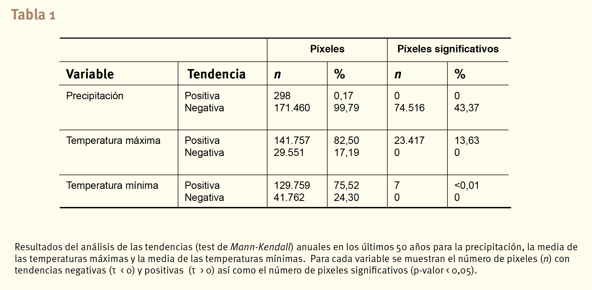

```{r options, include=FALSE, cache=FALSE}
library(rmarkdown)
library(knitr)
library(here)
library(tidyverse)
library(ggrepel)
library(ggplot2)
library(WVPlots)
library(GGally)


## Text results
opts_chunk$set(echo = FALSE, warning = FALSE, message = FALSE)

## Code decoration
opts_chunk$set(tidy = FALSE, comment = NA, highlight = TRUE, size = "footnotesize")

```


## ¿Qué es una **serie temporal**?

- Conjunto de observaciones registradas a intervalos regulares de tiempo. 
- En cada instante $t_{i}$ la observación proviene de una variable que puede tener igual o diferente distribución
- El orden de llegada de los datos es importante


- Ejemplos: temperaturas, productividad del bosque a lo largo del año, cantidad de agua que lleva un río cada día, etc.  

## ¿Por qué nos interesa analizar una **serie temporal**

- Para conocer como se repite a lo largo del tiempo (ciclo)
- Analizar si los datos se ajustan bien a un modelo teórico
- Analizar fenómenos espacio-temporales (avanzado)

## ¿Por qué nos interesa analizar una **serie temporal**
- Explicar la evolución de un fenómeno a lo largo del tiempo
```{r explain}
alisado <- HoltWinters(co2)
par(cex.axis=1.5, cex.lab=1.5, cex.main=1.5)
plot(alisado, ylab="Concentracion de CO2 (ppm)", xlab="", main="")
labs <- c("Valores observados", "Valores predichos")
legend("topleft", lty=c(1,1), col=c("black", "red"), legend=labs)
```

## ¿Por qué nos interesa analizar una **serie temporal**
- Predecir su valores en el futuro

```{r predict}
par(cex.axis=1.5, cex.lab=1.5, cex.main=1.5)
pred.alisado <- predict(alisado, n.ahead=120, prediction.interval=TRUE)
plot(alisado, pred.alisado, ylab="Concentración de CO2 (ppm)", xlab="", main="")
title("Predicciones de la concentración de CO2")
labs <- c("Valores observados", "Valores predichos", "IC de las predicciones")
legend("topleft", lty=rep(1,3), col=c("black", "red", "blue"), legend=labs)
```

## Tipos de Series Temporales 

- Falta de información sobre las distribuciones subyacentes (cada una con sus paráametros) de las variables que analizamos. Para cada variable solamente disponemos de un dato observado. 

{height=150px}

- **Solución**: Imponer condiciones a la serie de datos. 

## Tipos: Estacionarias 
```{r, eval=FALSE}
p <- read.table('http://www.iecolab.es/ecoinfo/precip_qp_caniar.csv', header = TRUE, sep=',')
plot(p, type='o', cex=0.8, pch=19, col='#325B84',
     main= 'Precipitacion en el Robledal de Caniar',
     ylab='Precipitacion (mm)', xlab='Time')
abline(h=mean(p$prec), lty=2, lwd=2, col='gray30')
```


```{r, fig.height=3.5}
presn <- read_csv(here::here("/datos/cummulated_precSN.csv"))

meandf <- mean(presn$csum_mean)
sddf <- sd(presn$csum_mean)
yeah <- presn %>% filter(csum_mean < (meandf - 1*sddf)) %>% 
  mutate(pos = csum_mean - 50) %>%  as.data.frame()
  
ggplot(presn, aes(x=hyear, y=csum_mean)) + 
  geom_hline(yintercept = meandf) + 
  # geom_errorbar(aes(ymin = csum_mean - csum_se, ymax= csum_mean + csum_se), width=.1, colour='gray') +
  geom_point(size=2) + theme_bw() + 
  geom_line(size=.25, colour = 'black') + 
  scale_x_continuous(breaks=seq(1950,2015, by=5)) +
  scale_y_continuous(breaks=seq(0,1500, by=250)) +
  theme(panel.grid = element_blank(),
        axis.title = element_text(size = 9),
        axis.text.y = element_text(size = 8)) +
  ylab('Annual Precipitation (mm)') + xlab('Year') 

```

- Los datos varían todo el tiempo alrededor del mismo **valor medio** y con la **misma variabilidad**
- La relación entre las observaciones en dos momentos del tiempo diferentes sólo depende del número de observaciones que distan entre ambas

 
## Tipos: No Estacionarias 
No se cumplen las condiciones de estacionariedad 
```{r, echo=FALSE, fig.width=12, fig.height=5}
data(co2)
plot(co2, ylab = expression("Atmospheric concentration of CO"[2]),
     col='#325B84', lwd=2,
     las = 1)
```

- Serie no estacionaria estacional con **tendencia**


## No Estacionarias  
```{r, echo=FALSE, fig.width=12, fig.height=5}
data(AirPassengers)
plot(AirPassengers, ylab="Numero de Pasajeros", xlab="time",
    col='#325B84', lwd=2)
```

- Aumenta la variabilidad con el tiempo (serie no estacionaria con tendencia y aumento de variabilidad)


## Trabajo con series temporales en R 
- Existen diferentes funciones para analizar series temporales en R https://cran.r-project.org/web/views/TimeSeries.html

- Objeto **ts**: Tipo especial de objeto dentro de R para las series temporales

## Trabajo con series temporales en R 
```{r, echo=TRUE}
clima <- read.csv(here::here("/datos/temp_guadarrama.csv"), 
                  header=TRUE, sep=";")
names(clima)[2] <- "YEAR"

# Seleccionar datos de la estacion Navacerrada 
navacerrada <- subset(clima, NOMBRE == "NAVACERRADA,PUERTO")

# Seleccionar variables
tmin <- navacerrada[, c("YEAR", "TM_MIN")]

# Crear un objeto de tipo ts 
tmin.ts <- ts(data = tmin$TM_MIN, 
              start = min(tmin$YEAR),
              end = max(tmin$YEAR))
```

## Trabajo con series temporales en R
```{r, echo=TRUE}
tmin.ts
```

## Trabajo con series temporales en R

```{r}
# Gráfica 
plot(tmin.ts)
```

## Trabajo con series temporales en R

```{r, echo=TRUE}
tmin.ts2 <- ts(data = tmin$TM_MIN, 
              start = min(tmin$YEAR),
              end = max(tmin$YEAR),
              frequency = 12)
```

## Trabajo con series temporales en R
```{r}
tmin.ts2
```

## Trabajo con series temporales en R
```{r, fig.height=4}
plot(tmin.ts2)
```

## Trabajo con series temporales en R
```{r}
boxplot(tmin.ts2~cycle(tmin.ts2), xlab="Mes", ylab="Temp. min.")
```

## Aproximaciones al estudio de las series temporales
- Modelos lineales (deterministas)
- Alisados exponenciales
- Extracción de señales
  
    - Descomposicion de una serie temporal
    - LOESS (*local polynomial regression fitting*)
    
- Modelos paramétricos ARIMA (Autoregressive Integrated Moving Average):

    - modelos AR (Autoregressive)
    - MA (Moving Averages)
    - ARMA (Autoregressive Moving Averages) para series estacionarias
    - Modelos integrados para las series no estacionarias

## Extracción de señales 

Descomposición aditiva de una serie temporal (extracción de señales)

$$y_t =T_t+S_t+I_t$$

- Tendencia ($T_t$) representa un movimiento suave a lo largo del tiempo que puede ser constante o variable
- Estacionalidad ($S_t$) (*Seasonality*) supone una oscilación dependiente de la estación
- Componente irregular ($I_t$) lo componen variaciones aleatorias no explicadas por las otras componentes


## Extracción de señales 
Procedimiento:

1. Se extrae la tendencia y se calculan los residuos (observaciones - tendencia). Los residuos son la serie sin tendencia, que contiene la estacionalidad y el componente irregular.

2. Se estima la estacionalidad de la serie y se resta a la serie sin tendencia, se obtiene la **serie desestacionalizada**. La serie desestacionalizada no debe contener ninguna estructura aparente y debe variar en torno a un valor constante, que es el **componente irregular**.

3. La predicción de la serie se realiza agregando al valor medio del componente irregular la predicción de tendencia y el componente estacional.

## Extracción de señales 
```{r, echo=TRUE} 
d.tmin <- decompose(tmin.ts2)
str(d.tmin)
```

- Valores predichos para la estacionalidad (`$seasonal`), la tendencia (`$trend`) y la componente irregular (`$random`)
- Valores promedios estimados para la componente estacional (`$figure`). 

## Extracción de señales 
```{r}
plot(d.tmin)
```


## Alisados exponenciales

- Es una aproximación determinista al tratamiento de series temporales
- Permiten predecir nuevos valores de la serie 
- Están basados en modelos paramétricos deterministas que se ajustan a la evolución de la serie
- Estos modelos permiten ajustar niveles y comportamientos tendenciales y estacionales que evolucionan en el tiempo, de
manera que las observaciones más recientes tienen más peso en el ajuste que las más alejadas
- Tipos: 
  
    - Alisado exponencial simple (no tendencia; no estacionalidad)
    - Alisado de Holt (tendencia; no estacionalidad)
    - Alisado de Holt-Winters (tendencia; estacionalidad)

## Alisados exponenciales 
```{r, echo = TRUE}
ordesa <- read.csv(file=here::here("datos/ordesa_ord.csv"))

# Seleccionar un municipio 
panticosa <- subset(ordesa, Municipio == "Panticosa")
head(panticosa)
```

## Alisados exponenciales 
```{r, echo=TRUE}
panticosa_ts <- ts(data = panticosa$Habitantes, 
                   start= min(panticosa$year), 
                   end = max(panticosa$year))
panticosa_holt <- HoltWinters(panticosa_ts, gamma=FALSE)

panticosa_holt
```

## Alisados exponenciales 
```{r, echo=TRUE}
panticosa_holt
```


## Alisados exponenciales 
```{r}
plot(panticosa_holt, ylab="Población", xlab="Tiempo", main="")
labs <- c("Valores observados", "Valores predichos")
legend("topleft", lty=c(1,1), col=c("black", "red"), legend=labs)
```

## Predicciones 

```{r, echo=TRUE}
panticosa_pred <- predict(panticosa_holt, n.ahead=5,
                          prediction.interval = TRUE)
panticosa_pred 
```

## Predicciones 
```{r}
plot(panticosa_holt, panticosa_pred, 
     main="", xlab = "Año", ylab="Habitantes")

legend("topleft", lty=rep(1,3), col=c("black", "red", "blue"), 
         legend=c("Valores observados", "Valores predichos", "IC de las predicciones"))
```


```{r, eval=FALSE}
autoplot(navacerrada)

ts_navacerrada <- ts(navacerrada[, c("T_MAX", "T_MIN")], start = c(min(navacerrada$YEAR),1), frequency = 12)
plot(tmax_navacerrada)
plot.ts(navacerrada$TMAX)


```

# Análisis de tendencias 

## ¿Ha aumentado significativamente la población de Panticosa en los últimos 20 años? 

```{r}
ordesa <- read.csv(file=here::here("datos/ordesa_ord.csv"))

# Seleccionar un municipio 
panticosa <- subset(ordesa, Municipio == "Panticosa")
head(panticosa)
```


## ¿Ha aumentado significativamente la población de Panticosa en los últimos 20 años? 
```{r}
plot(y = panticosa$Habitantes, x= panticosa$year, 
     xlab = "Año", ylab= "Habitantes")
lines(y = panticosa$Habitantes, x= panticosa$year)
```


## ¿Ha aumentado significativamente la población de Panticosa en los últimos 20 años? 

1. Análisis de tendencia (**test de Mann-Kendall**)
2. Magnitud del cambio (**Estimación de Theil-Sen Slope**)


## 1. Análisis de tendencias: **Mann-Kendall test**

- Es un caso especial del test de correlación de Kendall ($\tau$)
- Mide la asociación entre dos variables 
- Basado en el ranking relativo de los datos (no sobre los datos en sí)


- Hipótesis:
  
  - $H_{0}:$ No existe una tendencia en los datos (los dataos son independientes y etán ordenados aleatoriamente) 
  - $H_{1}:$ Existe una tendencia monótona (no necesariamente lineal)

## Construcción del estadístico y del test 

Supongamos que tenemos un conjunto de observaciones de dos variable aleatorias, $x$ (tiempo) e $y$ (ej. Precipitación):

$(x_1,y_1),(x_2,y_2),\dots,(x_n,y_n)$


```{r, echo=FALSE}
year <- seq(1980,1989, by = 1)
prec <- c(900, 875, 910, 725,830,730,750,710,690,715)

g <- data.frame(year, prec)
knitr::kable(g)

```


## 

```{r}
ggplot(g, aes(x=as.Date(as.character(year), format = "%Y"), y=prec)) + 
  geom_point(size=3, col="blue") + theme_bw() + ylim(0,1000) + 
  xlab("Tiempo") + ylab("Precipitación anual (mm)") 
  
```

## Construcción del estadístico y del test 

-  Se calcula el valor de un estadístico **tau**

$$\tau=\frac{(\text{n pares concordantes})-(\text{n pares discordantes})}{\frac{1}{2}n(n-1)}$$ 
    
Clasificamos los pares de observaciones $(x_i,y_i)$ y $(x_j,y_j)$ en: 

- **concordantes** si los rangos de ambos elementos concuerdan

  - $x_i > x_j$ y $y_i > y_j$ o
  - $x_i < x_j$ y $y_i < y_j$ 

- **discordantes** cuando no concuerdan 
  
  - $x_i > x_j$ y $y_i < y_j$ o 
  - $x_i < x_j$ y $y_i > y_j$ 


## Construcción del estadístico y del test 


$$S = \sum^{n-1}_{i=1}\sum^{n}_{i+1}sign(x_{i+1}-x_i)$$

donde:

- $sign(x_{i+1}-x_i) = 1$ cuando $x_{i+1}-x_i > 0$ 
- $sign(x_{i+1}-x_i) = 0$ cuando $x_{i+1}-x_i = 0$
- $sign(x_{i+1}-x_i) = -1$ cuando $x_{i+1}-x_i < 0$ 


Un valor alto de $S$ indica una tendencia creciente, mientras que un valor negativo indica una tendencia decreciente


## Construcción del estadístico (demostración)
```{r, echo=FALSE}
gg <- g[c(6:10),]
knitr::kable(gg) 

# ggplot(gg, aes(x=as.Date(as.character(year), format = "%Y"), y=prec)) + 
#   geom_point(size=3, col="blue") + theme_bw() + ylim(0,1000) + 
#   xlab("Tiempo") + ylab("Precipitación anual (mm)") 

```


- 715 > 690 (**1**) // 715 > 710 (**1**) // 715 < 750 (**-1**) // 715 < 730 (**-1**)  
- 690 < 710 (**-1**) // 690 < 750 (**-1**) // 690 < 730 (**-1**)
- 710 < 750 (**-1**) // 710 < 730 (**-1**)
- 750 > 730 (**1**)

## Construcción del estadístico (demostración)

$$\tau = \frac{S}{\frac{1}{2}n(n-1)}$$

$$\tau = \frac{-4}{\frac{1}{2}5(5-1)} = -0.4$$ 

```{r, echo = TRUE}
library(trend)
mk.test(gg$prec)
```

## Panticosa 

```{r}
plot(y = panticosa$Habitantes, x= panticosa$year, 
     xlab = "Año", ylab= "Habitantes")
lines(y = panticosa$Habitantes, x= panticosa$year)
```

## Panticosa
```{r}
mk.test(panticosa$Habitantes)
```

## Contraste de Hipótesis para el parámetro $\hat\tau$

- Hipótesis $H_{0}:$ $\tau = 0$ 

- Calculamos el estadístico $$z= \frac{S-sign(S)}{\sqrt{Var(S)}}$$


donde $$Var(S) = \frac{n(n-1)(2n+5)}{18}$$

- Bajo la Hipótesis nula, el valor de $z$ sigue aproximadamente una distribución normal


## Algunas ventajas de utilizar este test

- El valor de $\hat\tau$ varía entre -1 y 1 (similar al coeficiente de correlación de Kendall)

- Informa de la dirección de la tendencia y de la magnitud 

- Test estadístico muy utilizado en análisis de tendencias temporales para datos climatológicos, hidrológicos, evolución de población, etc.  

- Es un test no-paramétrico que no requiere que los datos cumplan normalidad 

- Se puede aplicar a datos estacionales, mensuales, etc (diferentes períodos de tiempo definidos por el usuario)

- Presenta una baja sensibilidad a los cambios abruptos en las series de datos no homogéneas  
 
## 2. Theil-Sen Slope: Estimación de la tasa de cambio

- Estimación no paramétrica de la pendiente (tasa de cambio) para el intervalo analizado
- Método para ajustar una línea a un conjunto de puntos
- Mediana de las pendientes de todos los pares de puntos 

$$\hat\beta = Median(\frac{Y_j - Y_i}{X_j-X_i})$$

```{r}
sens.slope(panticosa$Habitantes)
```


## Consideraciones sobre el análisis de la tendencia

- Clasificación de tendencias. Ejemplo seguimiento de Aves (TRIM)


## Consideraciones sobre el análisis de la tendencia
Análisis de tendencias de parámetros climáticos en Sierra Nevada

- Variación temporal de la tendencia 

{height=200px}

## Consideraciones sobre el análisis de la tendencia
... o sobre la importancia de realizar un Análisis exploratorio de los datos 

{height=200px}

- Precaución al analizar tendencias globales 
- Comparación de periodos, Modelos GAM

## Consideraciones sobre el análisis de la tendencia

¡Ojo con el análisis exploratorio de datos! 

```{r}
ggplot(panticosa, aes(x=year, y=Habitantes)) + geom_point() + theme_bw() 
```


## Consideraciones sobre el análisis de la tendencia

¡Ojo con el análisis exploratorio de datos! 
```{r}
ggplot(panticosa, aes(x=year, y=Habitantes)) + geom_point() + theme_bw() + ylim(0,1000)
```

## Ejemplos cómputo tendencias 
- Análisis de tendencias cubierta de nieve y clima en SN
https://sl.ugr.es/enebral_dist


```{r, eval=FALSE}
temp <- read.csv(here::here("/datos/temp_guadarrama.csv"), header=TRUE, sep=";")
names(temp)[2] <- "YEAR"

navacerrada <- temp %>% filter(NOMBRE == "NAVACERRADA,PUERTO") %>% 
  mutate(TM_MAX = TM_MAX/10, TM_MIN = T_MIN/10)
autoplot(navacerrada)

ts_navacerrada <- ts(navacerrada[, c("T_MAX", "T_MIN")], start = c(min(navacerrada$YEAR),1), frequency = 12)
plot(tmax_navacerrada)
plot.ts(navacerrada$TMAX)

library(forecast)

autoplot(ts_navacerrada, facets = TRUE)

autolayer(ts_navacerrada)

```

## Recursos (algunos)

- Falk M (2012). A First Course on Time Series Analysis - Examples with SAS. Chair of Statistics, University of Wurzburg. http://www.statistik-mathematik.uni-wuerzburg.de/wissenschaftforschung/time_series/the_book/ 
- CRAN Task View: Time Series Analysis https://cran.r-project.org/web/views/TimeSeries.html 
- Helsel, D.R., and R. M. Hirsch. (2002). Statistical Methods in Water Resources. Techniques of Water Resources Investigations, Book 4, chapter A3. U.S. Geological Survey. http://pubs.usgs.gov/twri/twri4a3/pdf/twri4a3-new.pdf.
- Cayuela, L, y Justel, A. 2015. Series temporales en R. http://db.orangedox.com/9fzOYs2ZoimR4izLVE/7-Series%20temporales%20en%20R.pdf 